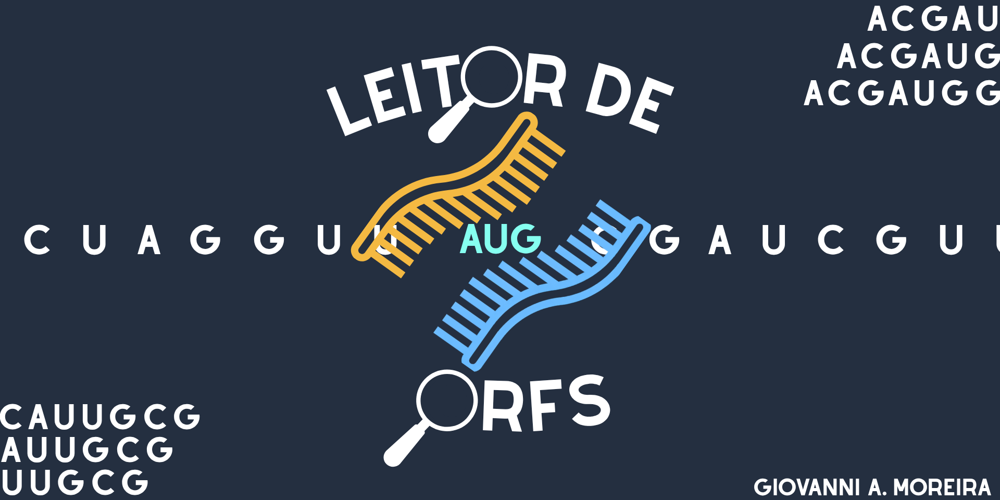
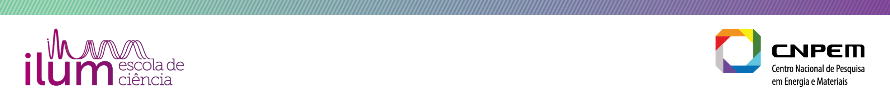

  

# 🧬 Leitor de ORFs 🧬

Projeto final realizado para a disciplina de Práticas em Ciência de Dados, no primeiro semestre de 2026, do curso de Ciência e Tecnologia, Ilum Escola de Ciência

A ideia para o projeto surgiu da intenção de relacionar conceitos de Biologia com as funcionalidades do Python estudadas durante o primeiro semestre. Por esse motivo, optou-se por aplicar ideias de processamento de strings, estruturas de dados e composição de gráficos para identificar e comparar *Open Reading Frames* (ORFs) em sequências de DNA ou RNA.

O programa tem como objetivo encontrar as ORFs presentes em um genoma, calcular sua quantidade de aminoácidos e seu percentual de nucleotídeos citosina e guanina (GC%), e comparar essas métricas entre dois genomas distintos através de gráficos de barra. Essa análise pode revelar características biológicas dos organismos comparados, como a presença de ORFs espúrias ou sinais de assinatura genômica relacionados a fenômenos como a transferência horizontal de genes.

# 🛠️ Ferramentas Utilizadas 🛠️

### Nota sobre o uso de IA

Foram utilizadas ferramentas de Inteligência Artificial generativa: Claude (Anthropic) e Copilot (Microsoft) em conjunto para: compreensão e utilização das bibliotecas matplotlib e Biopython; revisão de estilo do código e gramática nas células de Markdown; confirmação e discussão das interpretações biológicas relacionadas a ORFs, comprimento e conteúdo GC, com base na literatura estudada (posteriormente referenciada na seção "Referências") e apoio na identificação e correção de erros na lógica dos códigos durante o desenvolvimento. Porém, a programação dos códigos, os textos finais e as conclusões científicas são de autoria própria.

### Bibliotecas e Módulos

* [Biopython](https://biopython.org/) (SeqIO)
* [Matplotlib](https://matplotlib.org/)

#### Versão do Python

* Python 3.13.7

  
# 💻 Instalação e Instruções 💻

### Instalação do Código

O código principal para a execução deste projeto é o arquivo `Leitor_de_ORFs.ipynb`, se encontra nesse repositório GitHub, na pasta `Leitor_de_ORFs`. Junto com ele, é necessária a pasta `sequencias/`, que contém os genomas de teste em formato FASTA (`.fna`) utilizados no projeto, e é onde o usuário deve inserir os genomas que deseja testar.

Ao realizar o download, é possível perceber que o arquivo é um Jupyter Notebook, ou seja, deve ser rodado em programas que possuam um Jupyter Kernel, como o JupyterLab ou o Visual Studio Code, que inclusive, foram os programas utilizados para a elaboração e testes do projeto.

⚠️ IMPORTANTE ⚠️

Para o funcionamento correto do código, é essencial que a pasta `sequencias/` esteja salva no mesmo diretório do notebook. Se o usuário quiser testar outras sequências além das fornecidas, é necessário salvar o novo arquivo FASTA (`.fna`) dentro dessa mesma pasta.

### Instalação das Bibliotecas

Antes de executar o notebook, é preciso garantir que as bibliotecas citadas anteriormente estejam instaladas no ambiente Python utilizado. Caso alguma delas não esteja, basta criar uma nova célula no notebook, digitar **pip install** *(nome da biblioteca)* e executar. Por exemplo, para instalar o Biopython, basta digitar `pip install biopython`.

### Como Usar:

1. Abra o `Leitor_de_ORFs.ipynb` e execute as células em ordem.
2. Quando solicitado na célula de código de carregamento, digite o nome de dois arquivos `.fna` (incluindo a extensão), exatamente como aparecem na tabela da seção 1 do notebook, ou insira o nome de outro arquivo FASTA de sua escolha, desde que ele esteja salvo em `sequencias/`.
3. Ao executar a função `comparar_orfs()`, escolha um nome para identificar cada genoma nos gráficos que serão gerados.
4. O notebook exibirá três figuras comparando os dois genomas: número total de ORFs, distribuição de comprimento (aa) e distribuição de conteúdo GC (%).

  
# 📂 Sequências de Teste 📂

A pasta `sequencias/` contém 6 sequências de organismos distintos, disponíveis para uso imediato:

|Nome do Arquivo|Origem|
|:---------------:|:--------:|
|teste_DNA1.fna|*Pseudomonas putida*|
|teste_DNA2.fna|*Pseudomonas aeruginosa PAO1*|
|teste_RNA3.fna|*HIV-1 M_97CD.KTB119*|
|teste_DNA4.fna|*Acanthamoeba polyphaga mimivirus*|
|teste_DNA5.fna|*Escherichia coli O157:H7*|
|teste_DNA6.fna|*Escherichia coli str. K-12*|

*As sequências foram obtidas no National Center for Biotechnology Information (NCBI).*

# ⚠️ Limitações do código ⚠️

Este código se trata de um algoritmo simples e não substitui ferramentas profissionais de predição gênica. Entre suas principais limitações:

* Não distingue qual dos três quadros de leitura corresponde ao gene real, captura ORFs de todos eles sem distinção.
* Não busca ORFs na fita complementar.
* Não detecta *start codons* não canônicos nem *readthrough* de *stop codons* (relevantes especialmente em genomas virais).
* Não captura corretamente ORFs em genomas com exons e introns (mais comum em eucariotos)
* Aceita símbolos ambíguos de nucleotídeos (R, Y, K, M, etc.), mas não os interpreta estatisticamente. Isso afeta a contagem, o comprimento e o conteúdo GC das ORFs encontradas.

  
Uma discussão mais detalhada de cada limitação está disponível nas células de markdown do próprio notebook.

# 👤 Desenvolvedor do Projeto 👤

[ ✨Giovanni de Almeida Moreira✨](https://github.com/PangioAAA)

**Giovanni de Almeida Moreira** (2610060)

Aluno do primeiro semestre de Ciência e Tecnologia, na Ilum Escola de Ciência

* Desenvolveu integralmente a lógica de identificação de ORFs, cálculo de métricas (GC% e comprimento) e geração dos gráficos comparativos
* Estudou Biopython e Matplotlib para o carregamento e tratamento de sequências FASTA e plotagem de gráficos
* Pesquisou e discutiu a fundamentação biológica das métricas utilizadas (ORFs espúrias, assinatura genômica e GC%)

  
Agradecimento especial aos professores da disciplina de Práticas em Ciência de Dados, por todo o aprendizado durante o semestre:

⭐ Professor Leandro Nascimento Lemos

⭐ Professor Daniel Roberto Cassar

⭐ Professor James Moraes de Almeida

